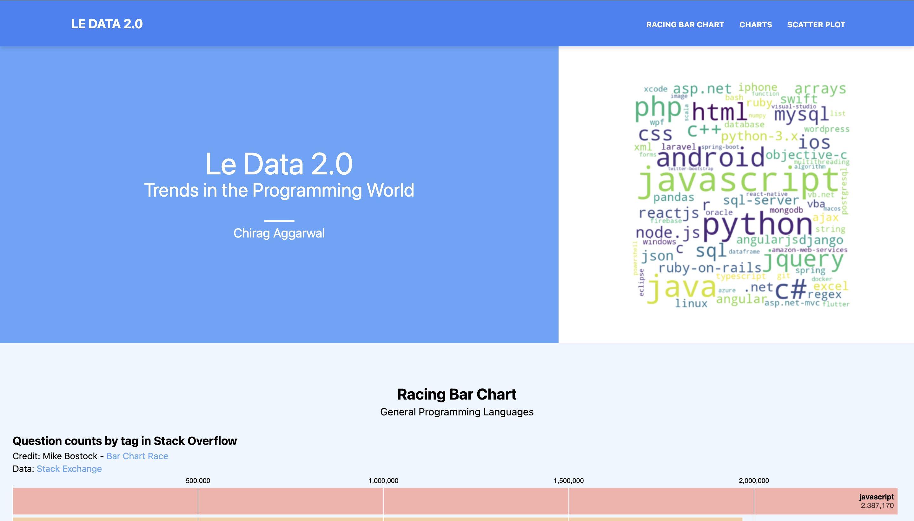

# Le-Data-2.0   Trends in the Programming World
This project seeks to visualize trends seen across programming technologies. 
It visualizes data from the following resources.
- Stack Overflow
- GitHub
- LinkedIn

## Usage
To view this project, navigate to the github-pages associated with this repository or click on the link below.  
[Trends in the Programming World](https://aggarwalc.github.io/le-data-2.0/)  

## Data
To update the data so that the charts display the latest information navigate to the [le-data-2.0-DATA](https://github.com/aggarwalc/le-data-2.0-DATA) repository.  
Follow the instructions in the README.md
